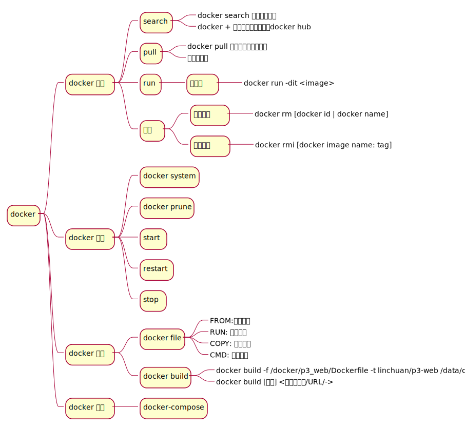

# Table of Contents

1.  [docker](#org6581ccb)
    1.  [linux下的安装](#org7a59760)
        1.  [Step 1 apt-get install docker-ce](#orgf2159f5)
        2.  [Step 2 — Executing the Docker Command Without Sudo (Optional)](#org02561dc)
        3.  [Step 3 修改docker数据存储路径](#org9703901)
    2.  [国内仓库](#orgcb2a446)
    3.  [常用命令](#org1150584)
    4.  [删除](#org457cddb)
    5.  [copy file](#org3bc3416)
2.  [docker-compose](#org9134a62)
    1.  [docker-compose](#orgbbe38e4)
    2.  [compose 不退出](#org8fe439e)
    3.  [docker-compose安装](#org62681c5)
3.  [docker-file](#org2e63a81)

# docker

## linux下的安装

### Step 1 apt-get install docker-ce

The Docker installation package available in the official Debian repository may not be the latest version. To ensure we get the latest version, we'll install Docker from the official Docker repository. To do that, we'll add a new package source, add the GPG key from Docker to ensure the downloads are valid, and then install the package.

First, update your existing list of packages:

    sudo apt update   

Next, install a few prerequisite packages which let apt use packages over HTTPS:  

    sudo apt install apt-transport-https ca-certificates curl gnupg2 software-properties-common

Then add the GPG key for the official Docker repository to your system:  

    curl -fsSL https://download.docker.com/linux/debian/gpg | sudo apt-key add -

Add the Docker repository to APT sources:  

    sudo add-apt-repository "deb [arch=amd64] https://download.docker.com/linux/debian $(lsb_release -cs) stable"

Next, update the package database with the Docker packages from the newly added repo:    

    sudo apt update

Make sure you are about to install from the Docker repo instead of the default Debian repo:   

    apt-cache policy docker-ce

You'll see output like this, although the version number for Docker may be different:  

    Output of apt-cache policy docker-ce
    docker-ce:
      Installed: (none)
      Candidate: 18.06.1~ce~3-0~debian
      Version table:
         18.06.1~ce~3-0~debian 500
    	500 https://download.docker.com/linux/debian stretch/stable amd64 Packages

Notice that `docker-ce` is not installed, but the candidate for installation is from the Docker repository for Debian 9 (stretch).

Finally, install Docker:

    sudo apt install docker-ce

Docker should now be installed, the daemon started, and the process enabled to start on boot. Check that it's running:  

    sudo systemctl status docker

The output should be similar to the following, showing that the service is active and running:  

    Output
    ● docker.service - Docker Application Container Engine
       Loaded: loaded (/lib/systemd/system/docker.service; enabled; vendor preset: enabled)
       Active: active (running) since Thu 2018-07-05 15:08:39 UTC; 2min 55s ago
         Docs: https://docs.docker.com
      Main PID: 21319 (dockerd)
       CGroup: /system.slice/docker.service
    	   ├─21319 /usr/bin/dockerd -H fd://
    	   └─21326 docker-containerd --config /var/run/docker/containerd/containerd.toml

Installing Docker now gives you not just the Docker service (daemon) but also the docker command line utility, or the Docker client. We'll explore how to use the docker command later in this tutorial.

### Step 2 — Executing the Docker Command Without Sudo (Optional)

**只有docker group的用户和root用户才能执行docker命令**

By default, the docker command can only be run the root user or by a user in the docker group, which is automatically created during Docker's installation process. If you attempt to run the docker command without prefixing it with sudo or without being in the docker group, you'll get an output like this:

    Output
    docker: Cannot connect to the Docker daemon. Is the docker daemon running on this host?
    See 'docker run --help'.

If you want to avoid typing sudo whenever you run the docker command, add your username to the docker group:

    sudo usermod -aG docker ${USER}

To apply the new group membership, log out of the server and back in, or type the following:

    su - ${USER}

You will be prompted to enter your user's password to continue.  

Confirm that your user is now added to the docker group by typing:  

    id -nG

Output  

    sammy sudo docker

If you need to add a user to the docker group that you're not logged in as, declare that username explicitly using:

    sudo usermod -aG docker username

The rest of this article assumes you are running the docker command as a user in the docker group. If you choose not to, please prepend the commands with sudo.

Let's explore the docker command next.   

1.  在tmux中将当前用户加入docker group

    1.  将用户hunch加入docker group中
        
            sudo usermod -aG docker hunch
    2.  刷新当前session
        
            newgrp docker
    
    Horribly hacky, but you could use two layers of newgrp to achieve this for a particular group:
    
        id -g
    
    &#x2026;will give you the current primary group ID. We'll call this origgroup for the purposes of this example. Then:
    
        newgrp <new group name>  
    
    &#x2026;will switch you to that group as the primary and add it to the list of groups returned by groups or id -G. Now, a further:
    
        newgrp <orig_group>
    
    &#x2026;will get you a shell in which you can see the new group and the primary is the original one.
    
    This is horrible and will only get you one group added at a time, but it has helped me out a couple of times to get groups added without logging out/in my whole X session (e.g. to get fuse added as a group to a user so that sshfs will work).
    
    Edit : This doesn't require you to type your password either, which su will.

### Step 3 修改docker数据存储路径

1.  `/etc/docker/daemon.json`
    
        {
          "data-root": "/data/docker"
        }

2.  已有数据同步到 `/data/docker`
    
        sudo rsync -axPS /var/lib/docker/ /data/docker

3.  重启docker
    
        sudo systemctl stop docker
        sudo systemctl start docker
        sudo systemctl restart docker

## DONE 国内仓库

`/etc/docker/daemon.json`

    {
      "registry-mirrors": ["https://registry.docker-cn.com"]
    }

## 常用命令

    docker info | grep 'Docker Root Dir'
    docker rmi
    docker rm
    docker search
    docker run
    docker pull
    docker commit -m "added Node.js" -a "sammy" d9b100f2f636 sammy/ubuntu-nodejs
    docker run -dit --name os centos
    docker exec -it CONTAINER_ID sh
    docker build -f /path/to/dockerfile -t nginx:v3 .
    docker build -f ~/docker/p3_web/Dockerfile -t linchuan/p3-web /data/code
    docker build [选项] <上下文路径/URL/->

## 删除

    docker image prune
    docker container prune
    docker system prune -a
    docker system df

## copy file

    docker cp /opt/test/file.txt mycontainer：/opt/testnew/
    docker cp mycontainer：/opt/testnew/file.txt /opt/test/

[返回](docker.md)

# docker-compose

    docker-compose up #启动所有容器 
    docker-compose up -d #后台启动并运行所有容器 
    docker-compose up --no-recreate -d #不重新创建已经停止的容器 
    docker-compose up -d test2 #只启动test2这个容器 
    docker-compose stop #停止容器 
    docker-compose start #启动容器 
    docker-compose down #停止并销毁容器

## docker-compose

    version: "0.1"
    services:
      test1: 
        image: "10.8.52.225:5000/base:v1.2.1_autoserver" 
        ports: 
          - "1022:22" 
          - "1080:80" 
        volumes: 
          - /work/test1:/work 
        dns: 
          - 10.1.2.9 
          - 10.1.2.70 
        hostname: test1 
      test2: 
        image: "10.8.52.225:5000/base:v1.2.1_autoserver" 
        ports: 
          - "1023:22" 
        volumes: 
          - /work/test2:/work 
        dns: 10.1.2.9 
        hostname: test2 
        links: 
          - els1:db

## compose 不退出

Docker镜像的缺省命令是 `bash~，如果不加 ~-it`, `bash` 命令执行了自动会退出，加 `it` 后 `docker` 命令会为容器分配一个伪终端，并接管其 `stdin/stdout` 支持交互操作，这时候 `bash` 命令不会自动退出

像不使用 `docker-compose`,我们会执行类似如下的命令

    docker run -it --name node node

但 `docker-compose` 需要额外配置下

需要在 `docker-compose.yml` 中包含以下行:

    stdin_open: true  
    tty: true  

第一个对应于 `docker run` 中的 `-i` ,第二个对应于 `-t` 。

## docker-compose安装

1.  install
    
        sudo curl -L "https://github.com/docker/compose/releases/download/1.23.2/docker-compose-$(uname -s)-$(uname -m)" -o /usr/local/bin/docker-compose
        sudo chmod +x /usr/local/bin/docker-compose
    
    上面的版本号参考:<https://github.com/docker/compose/releases>
2.  zsh自动补全
    
        mkdir -p ~/.zsh/completion
        curl -L https://raw.githubusercontent.com/docker/compose/1.23.2/contrib/completion/zsh/_docker-compose > ~/.zsh/completion/_docker-compose
    
    `.zshrc` 文件中增加下面两行:
    
        fpath=(~/.zsh/completion $fpath)
        autoload -Uz compinit && compinit -i

# TODO docker-file

